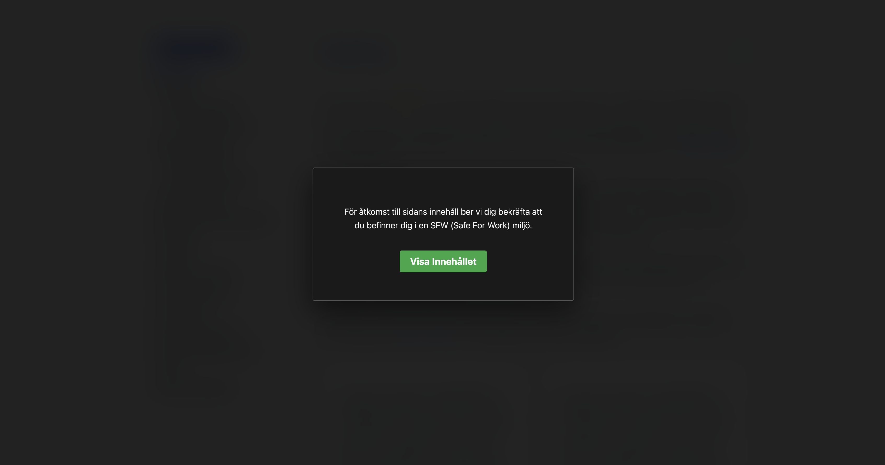

# JS.-HTML.-CSS-NSFW-Not-Safe-For-Work-och-SFW-Safe-For-Work-Switch
Applicerar med hjälp av JS, HTML, och CSS en overlay med information där besökaren ombeds bekräfta via knapptryck att "dom befinner sig i en SFW miljö" innan sidan visas. Vid behov kan NSFW läget togglas PÅ/AV.

## NSFW och SFW
**NSFW** står för **Not Safe For Work** och **SFW** står i detta fallet för **Safe For Work** varav del av en webbplats innehåll, alternativt hela webbplatsens innehåll, kan omfattas av **NSFW**. Oavsett vad **NSFW** kan associeras till, så är detta en simpel lösning att implementera.

## Design och Layout


## CSS Koden
```css
body.nsfw > :not(#nsfw-overlay) {
    filter: blur(20px);
    pointer-events: none;
    user-select: none;
    transition: filter 0.4s ease;
}

#nsfw-overlay {
    position: fixed;
    inset: 0;
    background: rgba(0, 0, 0, 0.85);
    backdrop-filter: blur(5px);
    display: flex;
    align-items: center;
    justify-content: center;
    z-index: 99999;
    color: #fafafa;
    text-align: center;
}

.nsfw-box {
    background: #1a1a1a;
    padding: 3rem;
    border-radius: 4px;
    border: 1px solid #555;
	width: 100%;
    max-width: 500px;
    box-shadow: 0 20px 50px rgba(0,0,0,0.5);
}

.nsfw-box p {
    font-size: 0.9rem;
    line-height: 1.6;
    margin-bottom: 2rem;
}

.nsfw-box button {
    background: #28a745;
    color: #fafafa;
    border: none;
    padding: 10px 20px;
    font-size: 1rem;
    font-weight: bold;
    border-radius: 4px;
    cursor: pointer;
    transition: transform 0.2s, background 0.2s;
}

.nsfw-box button:hover {
    background: #218838;
    transform: scale(1.02);
}

/* detta är för "Aktivera NSFW" knappen */
.bottom-right {
	position: fixed;
	bottom: 2rem;
	right: 2rem;
	z-index: 995;
}
```

## HTML Koden
```html
<!-- applicera nsfw klassen på <body> elementet -->
<body class="nsfw">
<!-- knappen nedan kan du placera var du vill i din HTML kod (den styrs av CSS) -->
<button onclick="resetNSFW(event)" class="copy-section-btn bottom-right">Aktivera NSFW</button>
```

## JavaScript Koden
```javascript
(function() {
const isConfirmed = localStorage.getItem('sfw_confirmed') === 'true';
if (isConfirmed) {
document.body.classList.remove('nsfw');
}
document.addEventListener('DOMContentLoaded', () => {
if (document.body.classList.contains('nsfw') && !isConfirmed) {
injectNSFWOverlay();
}
});
})();
function injectNSFWOverlay() {
if (document.getElementById('nsfw-overlay')) return;
const overlay = document.createElement('div');
overlay.id = 'nsfw-overlay';
overlay.innerHTML = `<div class="nsfw-box"><p>För åtkomst till sidans innehåll ber vi dig bekräfta att du befinner dig i en SFW (Safe For Work) miljö.</p><button onclick="confirmSFW()">Visa Innehållet</button></div>`;
document.body.appendChild(overlay);
}
function confirmSFW() {
localStorage.setItem('sfw_confirmed', 'true');
const overlay = document.getElementById('nsfw-overlay');
if (overlay) overlay.remove();
document.body.classList.remove('nsfw');
}
function resetNSFW(e) {
if (e && e.preventDefault) {
e.preventDefault();
}
localStorage.removeItem('sfw_confirmed');
document.body.classList.add('nsfw');
if (typeof injectNSFWOverlay === "function") {
injectNSFWOverlay();
}}
```

Vid frågor, skicka mejl till projektnano.xyz@proton.me
